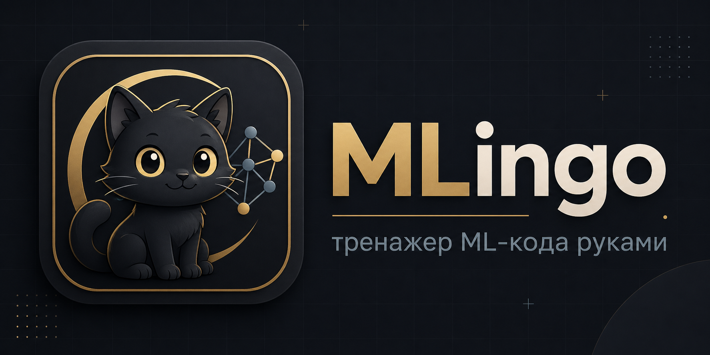

# MLingo



MLingo — тренажер для практики ML-кода руками. Проект собирает короткие упражнения по NumPy, Pandas, PyTorch, computer vision, segmentation, validation, boosting, recommender systems, transformers и diffusion basics.

Цель проекта — прокачивать не только знание идей, но и привычку быстро писать рабочий код в contest-style условиях: без бесконечного контекста, без готовых шаблонов и без слепого копирования.

## Возможности

- Короткие интерактивные задания: выбор ответа, порядок строк, пропуски, поиск бага, исправление кода, ручное написание кода и свободный разбор идеи.
- Дорожные карты по темам, профиль, опыт, стрики и локальный прогресс.
- Offline-first режим: приложение продолжает работать с уже загруженными заданиями.
- JSON-паки заданий: банк задач можно расширять без пересборки приложения.
- Импорт и синхронизация паков из GitHub raw URL.
- GitHub-вход: аккаунт MLingo создается автоматически после OAuth.
- GitHub sync: прогресс и решения можно сохранять в отдельный репозиторий.
- Разборы решений: публичная лента решений участников, комментарии и ссылки на GitHub.
- Кнопка “Нашли ошибку?” открывает prefilled GitHub Issue по конкретному уроку.
- PWA, Android shell через Capacitor и macOS shell на WKWebView.

## Сайт

Публичная версия:

```text
https://mlingo.online
```

Уроки доступны без входа. GitHub нужен для облачной синхронизации, leaderboard и разборов решений.

## Скачать Приложения

Все сборки публикуются в GitHub Releases:

```text
https://github.com/Lambdaderta/mlingo/releases/latest
```

Скачать macOS DMG через терминал:

```bash
python3 - <<'PY'
import json, urllib.request
release = json.load(urllib.request.urlopen("https://api.github.com/repos/Lambdaderta/mlingo/releases/latest"))
asset = next(a for a in release["assets"] if a["name"].endswith("-macOS.dmg") or a["name"].endswith("-macOS.zip"))
urllib.request.urlretrieve(asset["browser_download_url"], asset["name"])
print(asset["name"])
PY
open MLingo-*-macOS.*
```

Если macOS ругается на quarantine после установки:

```bash
xattr -dr com.apple.quarantine /Applications/MLingo.app
open /Applications/MLingo.app
```

Скачать Android APK через терминал:

```bash
python3 - <<'PY'
import json, urllib.request
release = json.load(urllib.request.urlopen("https://api.github.com/repos/Lambdaderta/mlingo/releases/latest"))
asset = next(a for a in release["assets"] if a["name"].endswith(".apk"))
urllib.request.urlretrieve(asset["browser_download_url"], "MLingo.apk")
print("MLingo.apk")
PY
```

Установить APK на подключенный Android-телефон:

```bash
adb install -r MLingo.apk
```

## Пакеты Заданий

Bundled-паки лежат в [lesson-packs](lesson-packs):

- `core.json` — основной банк MLingo, раньше был внутри `app.js`.
- `cv-offline-pack.json` — CV пайплайны, segmentation, classification и идейные задачи.
- `cv-fundamentals-pack.json` — image IO, masks, bbox, transforms, CNN/U-Net basics.
- `recsys-rerank-pack.json` — candidate generation, reranking, ranking metrics и leakage-safe validation.
- `dl-advanced-pack.json` — transformers, diffusion, RL basics и training tricks.
- `contest-expansion-pack.json` — дополнительные contest-задачи по CV, recsys и deep learning.
- `detection-vrd-pack.json` — object detection formats, DETR targets и predicate classifier для visual relations.

Индекс паков хранится в [lesson-packs/index.json](lesson-packs/index.json). Формат описан в [docs/lesson-packs.md](docs/lesson-packs.md).

## GitHub Sync

MLingo умеет сохранять прогресс и решения в GitHub-репозиторий пользователя. Сейчас доступны два режима:

- serverless token mode — fine-grained token хранится локально в браузере;
- backend repo mode — OAuth и запись решений проходят через backend.

Подробнее: [docs/github-sync.md](docs/github-sync.md).

## Локальная Сборка

Android debug APK:

```bash
npm install
npm run android:debug
```

APK появится в:

```text
android/app/build/outputs/apk/debug/app-debug.apk
```

macOS app:

```bash
npm install
npm run macos:build
```

Артефакты появятся в `dist/`.

Подробности по APK, macOS build и GitHub Releases: [docs/apps.md](docs/apps.md).

## Проверки

```bash
npm test
npm run check
```

`npm test` проверяет синтаксис frontend, Python backend, JSON-паки, разрешенные библиотеки, PWA-контракты и базовую структуру приложения.

`npm run check` дополнительно собирает Capacitor web bundle и запускает smoke-тест локального сайта.

## Структура

- [index.html](index.html) — HTML-оболочка приложения.
- [styles.css](styles.css) — стили desktop/mobile интерфейса.
- [app.js](app.js) — логика приложения, прогресс, runner UI и offline режим.
- [lesson-packs](lesson-packs) — JSON-паки заданий, включая основной банк `core.json`.
- [server.py](server.py) — backend API, GitHub OAuth, PostgreSQL, leaderboard и review queue.
- [android](android) — Capacitor Android shell.
- [macos](macos) — macOS WKWebView shell.
- [docs](docs) — документация по пакам, приложениям, GitHub sync и деплою.
- [assets/brand](assets/brand) — брендовые ассеты проекта.

## Контрибьютинг

Перед добавлением задач прочитайте [CONTRIBUTING.md](CONTRIBUTING.md) и список разрешенных библиотек в [docs/allowed-libraries.md](docs/allowed-libraries.md).

Задания должны быть воспроизводимыми без интернета и без скачивания pretrained weights. Если задача требует внешние данные, они должны быть явно описаны или поставляться вместе с контестом.
